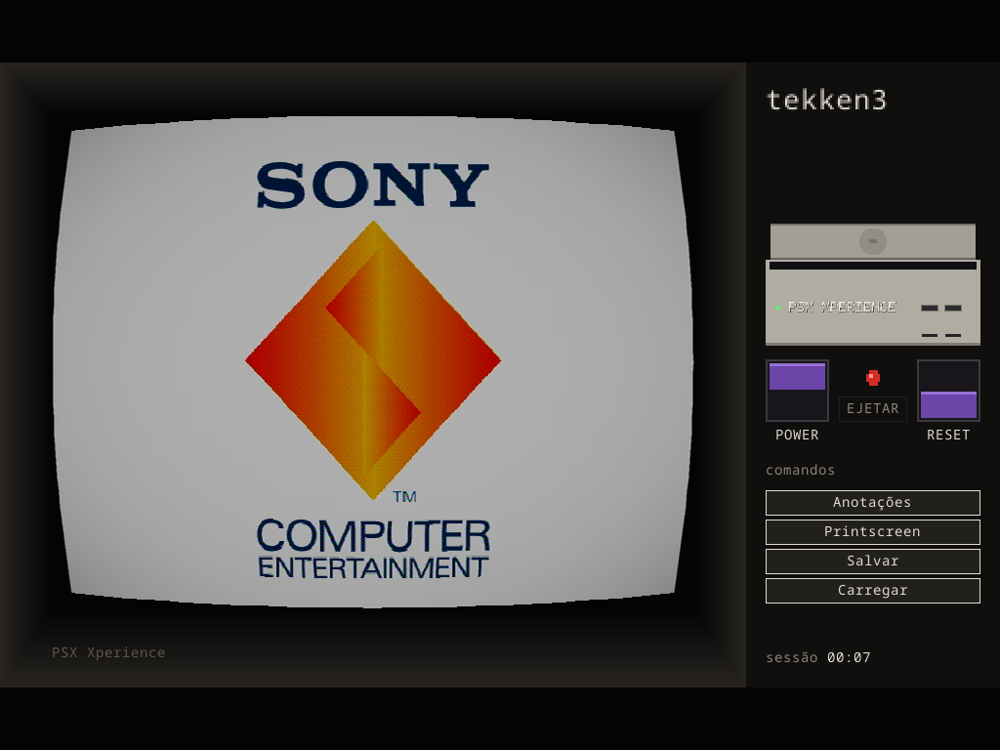

# Fase 3 — a moldura PSX

Portão da Fase 3 do [`plano-psx-xperience.md`](plano-psx-xperience.md): o
gabinete desenhado dentro da mesma cena — **a interface continua byte-a-byte
a do SNES Xperience**; muda o aparelho no bloco do painel.

## O que ficou pronto

- **O gabinete PSX no bloco do painel** (`draw_slot_furniture`): o console
  de frente em plástico cinza do SCPH-1001 — corpo, **tampa** com o **hub**
  ao centro (círculo rasterizado barra a barra), a **fenda** escura entre
  tampa e corpo, e na face: **LED de power** (verde com o console ligado,
  quase apagado desligado), **dois slots de memory card** com as portas de
  controle abaixo, e o **wordmark** embutido ("PSX XPERIENCE", pixel-font
  itálico novo no lugar do tag do SNES).
- **O disco entra pela fenda** (mesma matemática de movimento do cartucho,
  semântica nova): entra de cima com easing e desaparece na fenda — e em
  repouso fica **inteiro escondido**, tampa fechada, como no console real
  (`SEAT_HIDDEN_FRAC` > 1.0 cobre o conteúdo com folga; a fórmula de fit
  perdeu o bound de "sala em pé" do cartucho, que com fração > 1 dava
  escala negativa). A animação de inserir/ejetar do runner dirige tudo sem
  uma linha mudada.
- **Arte do disco**: `assets/disc/<nome-do-arquivo>.png` (no lugar de
  `assets/cartridge/`); sem arte local, o bloco mostra só o console. Um
  disco placeholder gerado ilustra a animação (`docs/img/fase3-disco.png`).
- **Boot real da BIOS no Power** — de graça desde a Fase 0 e agora em cena:
  apertar Power mostra o boot da Sony na TV, com som, porque é o core
  rodando a BIOS (imagem acima, frame 420 do Tekken 3).
- Toda a cerimônia herdada intacta: sinal off com chuvisco, trava de ejetar
  desligado, Reset momentâneo, "CH 3", a estante entrando por cima.

## Provas (headless, `emu-run --debug-cart-anim` / `--shot`)

- Frames da inserção: o disco desce e some na fenda (`img/fase3-disco.png`).
- Repouso: disco 100% escondido, tampa fechada (testes unitários novos
  `panel_disc_enters_from_above_and_hides_when_seated` /
  `panel_disc_seats_by_content_not_canvas` garantem a geometria).
- Em jogo: LED verde, gabinete fechado, boot da Sony na TV
  (`img/fase3-boot.png`).

- **Biblioteca de cards com UI** (plano §3, fechando a fase): clicar no
  slot de memory card do corpo abre o modal "Memory Cards" — os `.mcr` de
  `memcards/` (o encaixado marcado "— no slot"), a primeira linha criando
  "Cartão N" com o conteúdo atual do slot. A trava física vale como no
  hardware: clicar com o console **ligado** resiste com OSD ("desligue o
  console para trocar") — troca só desligado, igual ao ejetar o disco.
  Testes: `card_library_lists_mcr_files_and_marks_the_current`,
  `next_card_name_skips_existing`.

## Falta para fechar a Fase 3

- **Ícones e wordmark de arte final**: o wordmark atual é pixel-font
  placeholder (troque `crates/app/assets/console_tag.png`); ícones de app
  idem (`packaging/`).
- **480i sem warp**: decisão com jogo entrelaçado real na mão.
